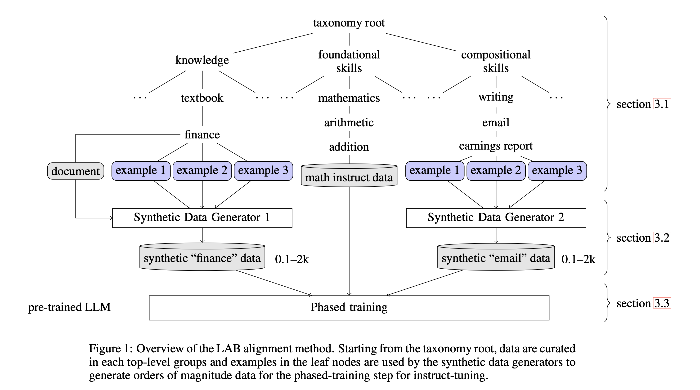

# InstructLab Community Learning Guide

InstructLab crowd sources the process of tuning and improving models by collecting two types of data, knowledge and skills. These submissions are collected in a taxonomy of YAML files to be used in the synthetic data generation process.

At this time, the InstructLab taxonomy is accepting Skills submissions only.

## Learning Topics

* [Skills Guide](./SKILLS_GUIDE.md)
* [Knowledge Guide](./KNOWLEDGE_GUIDE.md)

## License Limitations

If you would like to contribute any third-party data to either the Skills or Knowledge taxonomies, you must ensure the license on the data is unrestricted for commercial use.

This applies to:

* data embedded in `.md` files as knowledge
* data offered as `context` in `qna.yaml` files for skills
* questions and answers sourced from elsewhere and used as `qna.yaml` submissions

For this project, unless the file says otherwise, or unless the attributed source provided in the file says otherwise, the relevant open source license is the Apache License, Version 2.0. All contributions that leverage third party content should either come from the public domain (e.g. out of copyright, or .gov sites) or be licensed with an open data license that does not restrict commercial use or the creation of derivative works, including the following license types:
- CC0
- CDLA-Permissive
- CC-BY-4.0
- CC-BY-SA-4.0
- Apache 2.0
- MIT
Any third party content contributed to this project undergoes modifications in order to formulate it in the templated format required for submission to this project.

## Avoid These Topics

While the tuning process may eventually benefit from being used to help the models work with complex social topics, at this time this is an area of active research we do not want to take lightly. Therefore please keep your submissions clear of the following topics:

* Religion
* Politics - history is fine but avoid current politics
* PII (personally identifiable information)
* Violence
* Cyber Bullying
* Internal docs
* Discrimination
* Medical info
* Legal settlements/mitigations
* Gender Bias
* Hostile Language, threats, slurs, derogatory or insensitive jokes or comments
* Pornography
